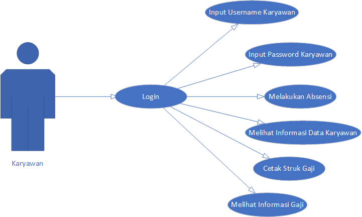

<b>Software Requirements Specifications</b> 
"Sistem Informasi Absensi dan Penggajian Kafka Konveksi"

 

    <b>Kelompok 2:</b> 
    1. Priliyandi (1703073)  
    2. Riyanwar Setiadi (1703087) 
    3. Setyo Abiansyah (1703071) 
    4. Uum Khumaeroh (1703084)

Kelas D3TI2C

 

 

<b>D3 TEKNIK INFORMATIKA</b> 
<b>POLITEKNIK NEGERI INDRAMAYU</b> 
<b>2019</b>

**1.** **Pendahuluan**  
	**1.1**	**Tujuan**  
<ol>Dokumen ini akan menyajikan deskripsi rinci tentang Sistem Informasi Absensi dan Penggajian di Kafka Konveksi yang akan dikembangkan. Dokumen akan menjelaskan mengenai spesifikasi pada Sistem Informasi Absensi dan Penggajian di Perusahaan Kafka seperti fitur sistem, antarmuka sistem, sistem apa yang akan dilakukan, apa saja kendala pada saat aplikasi beroperasi, dan bagaimana system akan bereaksi pada saat sedang digunakan oleh pemakai atau user.</ol>  

**1.2**	**Lingkup Masalah**  
<ol>Dokumen ini menyediakan acuan untuk pengendalian tentang Sistem Informasi Absensi dan Penggajian di Kafka Konveksi. Adapun ruang lingkup pembuatan aplikasi ini adalah berbasis website dan mobile yang memilih beberapa fasilitas yang ada yaitu : 

1.	Admin untuk mengelola data CRUD (Create, Read, Update, Delete) yang ada pada fitur- fitur Sistem Informasi Absensi dan Penggajian di Kafka Konveksi seperti input gaji hasil dari pekerjaan karyawan dan jenis pekerjaan, menambahkan data karyawan, mendaftarkan akun karyawan, serta memonitoring laporan rekap gaji. 
2.	Karyawan sebagai tempat melayani keinginan konsumen maupun dalam mendesain gambar. 
3.	Pemilik sebagai pemilik distro yang biasanya sudah memiliki konveksi sendiri untuk membuat berbagai produk-produk yang dipasarkan di distro tersebut.</ol> 
  

**1.3**	**Definisi, akronim, singkatan**  
		Adapun definisi dari dokumen tersebut adalah : 
		<table>
			<tr>
				<td> No </td>
				<td> Akronim </td>
				<td> Singkatan </td>
			</tr>
			<tr>
				<td> 1. </td>
				<td> SPMP </td>
				<td> Software Project Management Plan </td>
			</tr>
			<tr>
				<td> 2. </td>
				<td> SRS </td>
				<td> Software Requirements Specifications </td>
			</tr>
			<tr>
				<td> 3. </td>
				<td> SDD </td>
				<td> Software Design Document </td>
			</tr>
			<tr>
				<td> 4. </td>
				<td> DFD </td>
				<td> Data Flow Diagram </td>
			</tr>
			<tr>
				<td> 5. </td>
				<td> IEEE </td>
				<td> International Institute of Electronic and Electrical Engineers </td>
			</tr>
			<tr>
				<td> 6. </td>
				<td> CRUD </td>
				<td> Create, Read, Update, dan Delete </td>
			</tr>
			<tr>
				<td> 7. </td>
				<td> SIAPKK </td>
				<td> Sistem Informasi Absensi dan Penggajian di Kafka Konveksi </td>
			</tr>
		</table>
	**1.4**	**Referensi**  
IEEE. IEEE Std 830-1998 IEEE Recommended Practice for Software Requirements Specifications. 
	**1.5**	**Overview**  
<ol>Penulisan dokumen SRS ini dibagi menjadi beberapa bab sebagai berikut: 

**BAB I** berisi pendahuluan, menjelaskan mengenai tujuan pembuatan dokumen SRS, lingkup, definisi (akronim, atau singkatan), referensi, dan Overview. 

**BAB II** menjelaskan keseluruhan deskripsi dari Sistem Informasi Absensi dan Penggajian di Kafka Konveksi. Deskripsi umum tersebut memberikan gambaran lengkap mengenai semua fungsi yang akan dilakukan oleh sistem. 

**BAB III** berisi penjelasan detail dari  masing-masing kebutuhan lain yang spesifik. 

**BAB IV** berisikan tentang uraian mengenai informasi pendukung dalam pembuatan proyek Sistem Informasi Absensi dan Penggajian di Kafka Konveksi. </ol>

**2.** **Gambaran Umum** 
<ol>Kafka merupakan sebuah perusahaan konvenksi dengan karyawan yang cukup banyak. Oleh karena itu, sistem absen dan penggajian merupakan hal yang sangat pokok pada kegiatan financial sebuah perusahaan karena hal tersebut sangat berpengaruh kepada kinerja para pegawai yang setiap hari melakukan aktifitas. Sistem penggajian menyajikan cara-cara penggajian pegawai secara akurat, menghasilkan laporan-laporan yang diperlukan dan menyajikan kebutuhan informasi kepada manajemen. Adapun kendala yang dihadapi di Kafka konveksi yaitu absensi dan penggajian yang masih dilakukan secara manual masih berbentuk arsip sehingga memperlambat dalam proses pencarian, penghitungan dan proses pembuatan laporan penggajian. oleh karena itu, akan dirancang sebuah sistem informasi absensi dan  penggajian. Antara lain meliputi sistem absensi karyawan, sistem penghitungan gaji dan berbagai attributnya seperti lembur, cuti, potongan dan sebagainya secara terotomatisasi. Selain itu sistem juga mampu membuat berbagai laporan baik yang ditujukan untuk karyawan seperti slip gaji dan laporan yang ditujukan untuk direktur seperti laporan data karyawan, laporan absensi karyawan, dan laporan gaji karyawan secara terotomatisasi dimana system informasi tersebut dibuat dengan Framework Laravel dan Android. </ol>

**2.1** **Perspektif produk** 
<ol>Sistem Informasi Absensi dan Penggajian Karyawan di Kafka Konveksi adalah aplikasi yang digunakan untuk melakukan absensi dan cetak struk gaji melalui mobile yang sebelumnya menggunakan metode manual dengan menulis struk gajinya. Kemudian Sistem Informasi Absensi dan Penggajian Karyawan di Kafka Konveksi juga dapat melakukan perhitungan gaji karyawan </ol>

**2.1.1** **Antarmuka Sistem** 
**2.1.1.1**	**Use Cases Pemilik** 

**2.1.1.2** **Use Cases Karyawan** 

**2.1.1.3**	**Use Cases Admin** 

**2.1.2** **Antarmuka pengguna** 
<ol>Sistem Informasi Absensi dan Penggajian Karyawan di Kafka Konveksi menggunakan antarmuka berbasis mobile dan website. Dimana antarmuka mobile digunakan untuk karyawan sedangkan antarmuka website digunakan oleh admin. </ol>

**2.1.3** **Antarmuka perangkat keras** 
•	Laptop 
•	Processor Core i3 or higher 
•	Penyimpanan(Hardisk) Minimal 4 GB free space 
•	Smartphone minimal android Jelly Bean or higher 
•	Monitor resolusi 1240 x 768 colors 5 
•	Keyboard dan mouse compatible with windows 

**2.1.4** **Antarmuka perangkat lunak** 
<ol>Perangkat lunak yang dibutuhkan untuk aplikasi ini yaitu : </ol>
•	Windows 7 or higher 
•	Android Studio 
•	Corel Draw X7 
•	Database Mysql 
•	Balsamiq Mockups 3 
•	Sublime Text 3  

**2.1.5** **Antarmuka komunikasi**  
•	Paket Data 
•	Wifi 
•	Modem 
•	Smartphone 

2.1.6** **Batasan-batasan memori** 
•	RAM yang kami gunakan adalah minimal 4 gb. 
•	Memori yang dibutuhkan aplikasi minimal 50 mb. 

**2.1.7** **Operasi-operasi** 
•	Input data karyawan 
•	Input data absensi 
•	Input data gaji karyawan 
•	Input data pekerjaan 
•	Update data admin 
•	Update data karyawan 
•	Update data absensi 
•	Update data gaji karyawan 
•	Tampilan informasi karyawan 
•	Tampilan struk gaji karyawan 
•	Laporan Absensi 
•	Laporan rekap gaji 

**2.1.8** **Kebutuhan-kebutuhan dalam tahapan adaptasi** 

<ol>
Kebutuhan adaptasi yang diperlukan pada saat pengembangan aplikasi dengan menggunakan fungsi update data agar memudahkan admin dalam mengkoreksi pengetikan yang salah.
</ol>

**2.2** **Fungsi-fungsi produk** 

<ol>
•	Memudahkan proses absensi karyawan. 
•	Memudahkan dalam pembuatan laporan absensi, laporan struk gaji, dan laporan rekap gaji karyawan 
•	Memberi tahu karyawan tentang informasi data karyawan dan informasi gaji karyawan. 
•	Menambah data karyawan, data absensi, dan data gaji karyawan. 
•	Memudahkan pemilik kafka konveksi dalam melihat laporan rekap gaji, laporan absensi, dan laporan data karyawan. 
</ol>

**2.3** **Karakteristik pengguna** 

<ol>
•	Pengguna mampu membaca dan menulis. 
•	Pengguna mengerti cara menggunakan smartphone dengan sistem operasi android. 
•	Pengguna mengerti cara menggunakan PC dengan sistem operasi setidaknya windows. 
•	Mengerti cara menggunakan browser pada PC. 
</ol>

**2.4** **Batasan-batasan** 

<ol>
•	Berjalan pada platform android dan website 
•	Sementara ini aplikasi ini hanya untuk Kafka Konveksi 
•	Aplikasi ini tidak untuk layanan pemesanan 
</ol>

**2.5** **Asumsi-asumsi dan ketergantungan / keterkaitan** 
<ol>Sistem Informasi Absensi dan Penggajian Karyawan di Kafka Konveksi ini dapat dikembangkan lagi dengan menambah banyak perusahaan konveksi, dan penambahan super admin untuk konfirmasi perusahaan konveksi mana saja yang boleh menggunakan aplikasi ini. Sehingga aplikasi ini dapat digunakan oleh banyak perusahaan konveksi yang ingin menggunakan aplikasi ini.
</ol>

**2.6** **Kebutuhan-kebutuhan penyeimbang** 
	•	Customer Requirements  
<ol>Customer Requirements adalah analisis yang dilakukan terhadap pelanggan agar dapat mengetahui apa saja kebutuhan pelanggan sehingga pengembang dapat membuat sistem yang sesuai dengan kebutuhan pelanggan. </ol>
•	Detil Requirements 
<ol>Detil Requirements adalah suatu analisis yang terdiri dari properti dan fungsionalitas spesifik yang diekspresikan dalam bentuk yang detail </ol>

**3.** **Kebutuhan lain yang spesifik** 
	
**3.1** **Performa** 
•	Berjalan pada system operasi minimal android lollipop.  
•	Respon program kurang 30 detik.  
•	Berjalan pada browser apapun. </ol>

**3.2** **Keamanan Aplikasi**  
<ol>Validasi username dan password harus sesuai dengan yang didaftarkan sehingga tidak terjadi kesalahan login pada Sistem Informasi Absensi dan Penggajian Karyawan di Kafka Konveksi.
</ol>

**4.** **Informasi Pendukung** 
<ol>
		1. Informasi permasalahan yang sedang di alami 
		2. Informasi Perusahaan 
		3. Informasi sistem yang ada di perusahaan yang terkait dengan permasalahan yang diambil 
	</ol>